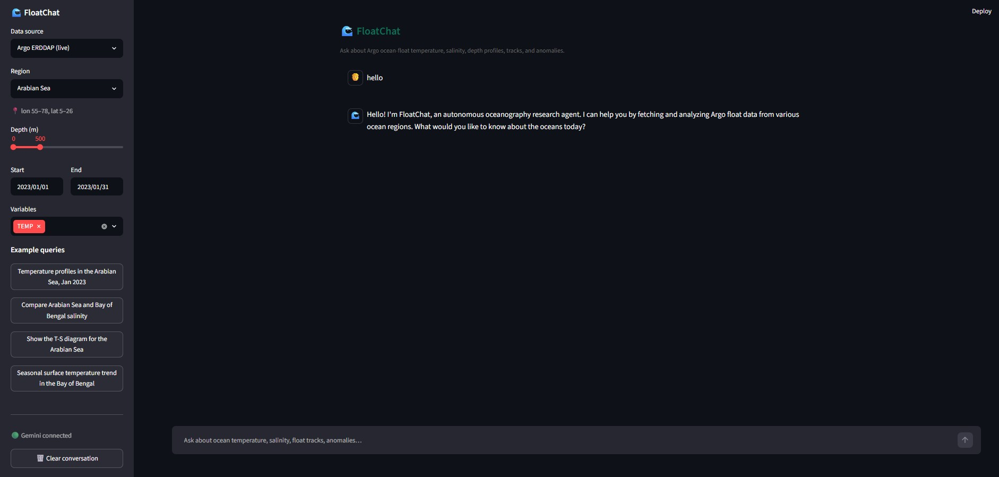
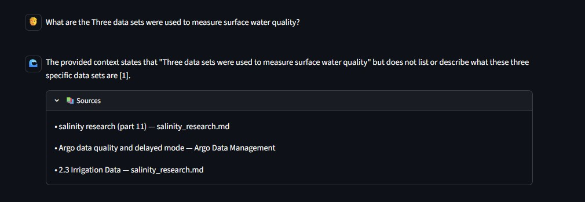
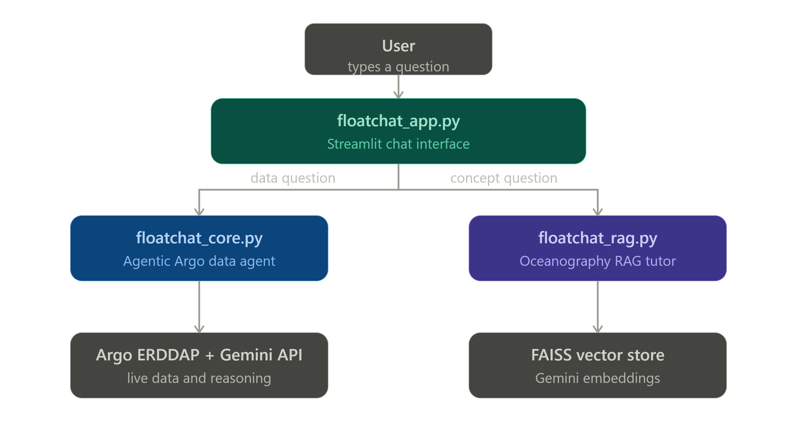

<div align="center">

# 🌊 FloatChat

**A conversational AI assistant for exploring Argo ocean-float data**

Ask about temperature, salinity, depth profiles, float tracks, and regional
anomalies in plain English — get back narrative answers with inline maps,
charts, and citations.

[](https://www.python.org/)
[](https://streamlit.io/)
[](https://ai.google.dev/)
[](https://github.com/facebookresearch/faiss)
[](https://plotly.com/)
[](https://argopy.readthedocs.io/)
[]()
[]()

</div>

---

## 📖 Overview

**FloatChat** lets you talk to the global [Argo float](https://argo.ucsd.edu/)
network the way you'd talk to a colleague. Type a question, and an
agentic Gemini-powered pipeline plans the right data calls, pulls live
oceanographic profiles, computes real metrics, and replies with a narrative
insight plus interactive maps and charts — all in one chat turn.

It also doubles as a **RAG-powered oceanography tutor**: conceptual questions
("What is a barrier layer?") are routed to a retrieval pipeline over a curated
+ user-extensible knowledge base instead of the data agent.

> 💡 The app ships with a **mock data fallback** for every external
> dependency (live Argo fetch, Gemini parsing, embeddings), so it runs
> end-to-end with zero API keys and zero internet access — perfect for a
> demo, and a clean upgrade path to a fully live deployment.

---

## 📸 Screenshots

<table>
<tr>
<td align="center" width="100%">

<br><sub><b>Data agent:</b> region/depth/date filters, narrative insight, live float-position map and depth profile</sub>
</td>
</tr>
<tr>
<td align="center" width="100%">

<br><sub><b>Region comparison</b> (table + bar chart) and the <b>RAG tutor</b> answering a conceptual question with cited sources</sub>
</td>
</tr>
</table>

> *Mockups illustrating the live UI's layout and ocean-themed styling — run
> the app locally to see it with real data (see [Installation](#-installation)).*

---

## ✨ Features

| | |
|---|---|
| 🗣️ **Natural-language queries** | Ask in plain English; Gemini parses intent, region, depth range, date range, and variables |
| 🤖 **Agentic, multi-step reasoning** | A bounded tool-calling loop plans → fetches → follows up, streaming its answer live |
| 🌊 **Live Argo data** | `argopy` → ERDDAP for real float profiles, with automatic graceful fallback to a mock dataset |
| 📚 **RAG oceanography tutor** | Conceptual questions are answered from a FAISS-indexed knowledge base, with cited sources |
| 📊 **Rich visualizations** | Depth profiles, T–S diagrams, seasonal time series, region comparison charts, Folium float maps |
| 🧭 **Transparent reasoning** | Expandable "Agent steps" trace shows exactly which tools were called |
| 🔌 **Offline-first** | Every external dependency (Gemini, argopy, embeddings) is optional and lazily loaded |
| 🎛️ **Interactive controls** | Sidebar filters for data source, region, depth, date range, and variables |

---

## 🏗️ Architecture

<p align="center">

</p>

**Request flow:**

1. **`floatchat_app.py`** (Streamlit) collects the prompt and sidebar filters.
2. A lightweight **router** (`floatchat_rag.is_rag_query`) decides whether
   the question is a *data* question or a *conceptual* one.
3. **Data questions** → `floatchat_core.py` runs a bounded (≤6 round) Gemini
   function-calling loop, choosing from `overview`, `compare`, `timeseries`,
   and `ts_diagram` tools, fetching from `argopy`/ERDDAP (or mock data), and
   streaming a narrative insight.
4. **Conceptual questions** → `floatchat_rag.py` retrieves the top-matching
   chunks (embedding + lexical hybrid search) from the FAISS vector store and
   `docs/` knowledge base, then streams a grounded, cited answer.
5. **`floatchat_viz.py`** turns the resulting data into Plotly charts and
   Folium maps, rendered back into the chat turn.

Every external call — Gemini, argopy/ERDDAP, embeddings — is wrapped so the
app **degrades gracefully** rather than crashing when a key or service is
unavailable.

---

## 🧰 Tech stack

- **Frontend:** [Streamlit](https://streamlit.io/)
- **LLM / agent:** [Google Gemini 2.5 Flash](https://ai.google.dev/) (function calling, streaming)
- **Ocean data:** [argopy](https://argopy.readthedocs.io/) → ERDDAP, with [xarray](https://xarray.dev/) / netCDF4
- **RAG:** [LangChain](https://www.langchain.com/), [FAISS](https://github.com/facebookresearch/faiss), [sentence-transformers](https://www.sbert.net/) / Gemini `text-embedding-004`
- **Visualization:** [Plotly](https://plotly.com/), [Folium](https://python-visualization.github.io/folium/)
- **Config:** [python-dotenv](https://pypi.org/project/python-dotenv/)

---

## 📁 Project structure

```
Floatchat AI/
├── assets/                          # README diagrams & screenshots
├── docs/                            # Oceanography knowledge base (RAG corpus)
│   ├── argo_ocean_paper.md
│   ├── indian_ocean_study.md
│   ├── salinity_research.md
│   ├── sample_barrier_layer.md
│   └── README.md                    # How to extend the knowledge base
├── notebooks/
│   └── FloatChat_Development.ipynb  # Exploration & prototyping
├── src/
│   ├── floatchat_app.py             # Streamlit UI (entry point)
│   ├── floatchat_core.py            # Agentic query parsing + Argo data + insight generation
│   ├── floatchat_rag.py             # RAG retrieval + conceptual Q&A engine
│   ├── floatchat_viz.py             # All Plotly/Folium visualizations
│   └── build_vectorstore.py         # One-off script to (re)build the FAISS index from docs/
├── vectorstore/
│   ├── index.faiss                  # Prebuilt FAISS index
│   └── index.pkl                    # Associated document store
├── requirements.txt
└── README.md
```

`floatchat_app.py` (presentation) depends on `floatchat_viz.py` (charts) and
`floatchat_core.py` / `floatchat_rag.py` (data + intelligence). The core,
RAG, and viz layers have no Streamlit dependency, so they're reusable from
the notebook or a future API layer.

---

## 🚀 Installation

### Prerequisites

- Python **3.11+**
- pip (or [uv](https://github.com/astral-sh/uv)/conda, optional)
- A [Gemini API key](https://aistudio.google.com/app/apikey) — **optional**, enables live NL parsing, agentic tool use, and embeddings (the app runs without one, using keyword parsing + mock data)

### 1. Clone and enter the project

```bash
git clone <your-fork-or-repo-url>
cd "Floatchat AI"
```

### 2. Create a virtual environment (recommended)

```bash
python -m venv .venv
source .venv/bin/activate      # Windows: .venv\Scripts\activate
```

### 3. Install dependencies

```bash
pip install -r requirements.txt
```

### 4. (Optional) Configure your API key

Create a `.env` file in the project root:

```env
GEMINI_API_KEY=your_gemini_api_key_here
```

Without this, FloatChat still runs fully — using keyword-based query parsing
and the bundled mock dataset.

### 5. Run the app

```bash
streamlit run src/floatchat_app.py
```

Open the URL Streamlit prints (default **http://localhost:8501**).

### (Optional) Rebuild the RAG vector store

The `vectorstore/` folder ships prebuilt. To regenerate it after editing
`docs/`:

```bash
python src/build_vectorstore.py
```

---

## 💬 Usage

Try prompts like:

- `Temperature profiles in the Arabian Sea, Jan 2023`
- `Compare Arabian Sea and Bay of Bengal salinity`
- `Show the T-S diagram for the Arabian Sea`
- `Seasonal surface temperature trend in the Bay of Bengal`
- `What is a barrier layer in the ocean?` *(routed to the RAG tutor)*

Use the sidebar to switch between **live Argo ERDDAP data** and **mock
sample data**, and to set region, depth range, date range, and variables
(`TEMP` / `PSAL` / `PRES`).

Each assistant turn can include an expandable **🧭 Agent steps** trace
(which tools ran) and a **📚 Sources** panel (for RAG answers), so the
reasoning stays transparent.

---

## ⚙️ Configuration reference

| Environment variable | Required? | Purpose |
|---|---|---|
| `GEMINI_API_KEY` / `GOOGLE_API_KEY` | No | Enables Gemini-powered query parsing, the agentic tool-calling loop, insight generation, and embeddings |

All other behavior (region presets, default depth/date range, variable list)
is configured directly in `floatchat_core.py` (`REGION_PRESETS`, `VARIABLES`).

---

## ☁️ Deployment

### Option A — Streamlit Community Cloud (fastest)

1. Push this repository to GitHub.
2. Go to [share.streamlit.io](https://share.streamlit.io) → **New app**.
3. Set:
   - **Repository:** your fork
   - **Main file path:** `src/floatchat_app.py`
4. Under **Advanced settings → Secrets**, add:
   ```toml
   GEMINI_API_KEY = "your_gemini_api_key_here"
   ```
5. Deploy — Streamlit Cloud installs `requirements.txt` automatically.

### Option B — Docker

```dockerfile
FROM python:3.11-slim

WORKDIR /app
COPY . .

RUN pip install --no-cache-dir -r requirements.txt

EXPOSE 8501
ENV STREAMLIT_SERVER_PORT=8501 \
    STREAMLIT_SERVER_ADDRESS=0.0.0.0

CMD ["streamlit", "run", "src/floatchat_app.py"]
```

```bash
docker build -t floatchat .
docker run -p 8501:8501 -e GEMINI_API_KEY=your_gemini_api_key_here floatchat
```

### Option C — Any VM / VPS (systemd)

```bash
pip install -r requirements.txt
streamlit run src/floatchat_app.py --server.port 8501 --server.address 0.0.0.0
```

Put it behind Nginx/Caddy for TLS, and manage the process with `systemd` or
`pm2` for restarts on crash/reboot.

> 🔐 In every option, never commit `.env` or API keys — use your platform's
> secrets manager (Streamlit Cloud secrets, Docker `-e`/`--env-file`, or a
> systemd `EnvironmentFile`).

---

## 🛰️ Going fully live

The app already prefers live data when `source = "Argo ERDDAP (live)"` is
selected; the `argopy` integration in `floatchat_core.py` follows this
pattern:

```python
from argopy import DataFetcher
ds = DataFetcher().region(
    [55, 78, 5, 26, 0, 500, "2023-01", "2023-02"]
).to_xarray()
```

To extend the **knowledge base** for the RAG tutor, drop additional
`.md`/`.txt` oceanography references into `docs/` and rerun
`src/build_vectorstore.py` — see `docs/README.md` for the chunking and
citation rules.

---

## 🗺️ Roadmap

- [ ] Persist downloaded NetCDF files to disk for offline reuse
- [ ] Add unit tests around `floatchat_core.compute_metrics` / `comparison_metrics`
- [ ] Support additional Argo variables (oxygen, chlorophyll)
- [ ] Add a lightweight FastAPI layer to expose the core/RAG logic outside Streamlit
- [ ] CI workflow (lint + smoke test) on push

---

## 🤝 Contributing

Issues and pull requests are welcome. Please keep `floatchat_core.py`,
`floatchat_rag.py`, and `floatchat_viz.py` free of Streamlit imports so they
stay reusable from the notebook and any future API layer.

---

## 📄 License

This project is intended to be released under the **MIT License** — add a
`LICENSE` file with the full text to make this official before publishing.

---

<div align="center">
<sub>Built for a capstone project · Data courtesy of the international <a href="https://argo.ucsd.edu/">Argo program</a></sub>
</div>
